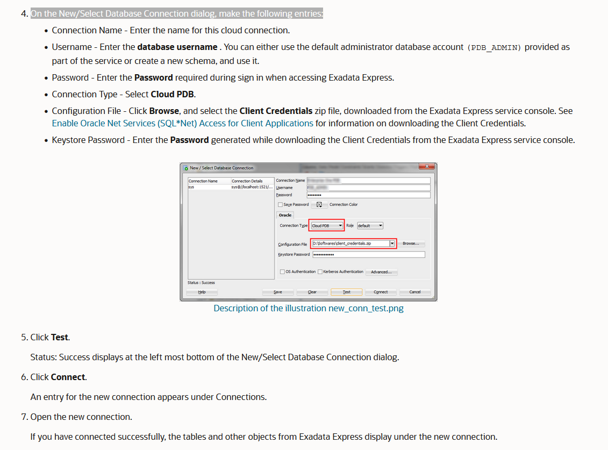

# Installation Guide for Oracle SQL and Database

### Requirements
   - [Oracle Database XE version 11.2g](https://www.oracle.com/database/technologies/xe-prior-release-downloads.html)
   - [SQL Developer 21.2.1](https://drive.google.com/file/d/19_jrK8aM6s9L8V_QqnLiw4HY3PtJ1Yrn/view?usp=sharing)

*Please Download the Required Software First*

---

### Installation Process:
- Install Oracle Database XE **(!Important)**
  - Oracle Database XE might take 5-10 min to install successfully.
  - ***You can use root as password if you are familiar with MySQL***

- After Oracle Database XE is installed.
  - Extract the SQL Developer 21.2 and Copy Paste the Folder into your C: Drive.
  - Go Inside your SQL Developer Folder and Find ```sqldeveloper.exe``` 
  - Right click and create a shortcut on your desktop.

- Installation Process is completed.

---

### Setting up the SQL Developer for First time

- To Check if the SQL Server are running properly.
  - Goto Start Menu and Find Run SQL Command Line 

- Click on Run SQL Command Line.
  - Inside the Run SQL Command Line type:
    ```connect system``` and then Enter the password.
  - You will see something like this: ```connected```
    

- Open SQL Developer Now
  - *You might see a popup window for the first time. Click No*
  - You will see something like this: 
  - *Make sure you see Database Detected*

- Under Connections, right click Connections.
 - The Connection menu appears. 

- Select New Connection
  - The New/Select Database Connection dialog appears. 

- On the New/Select Database Connection dialog, make the following entries:
  